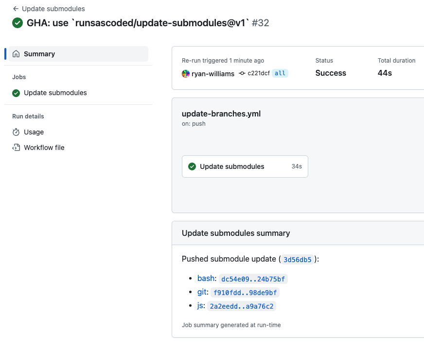
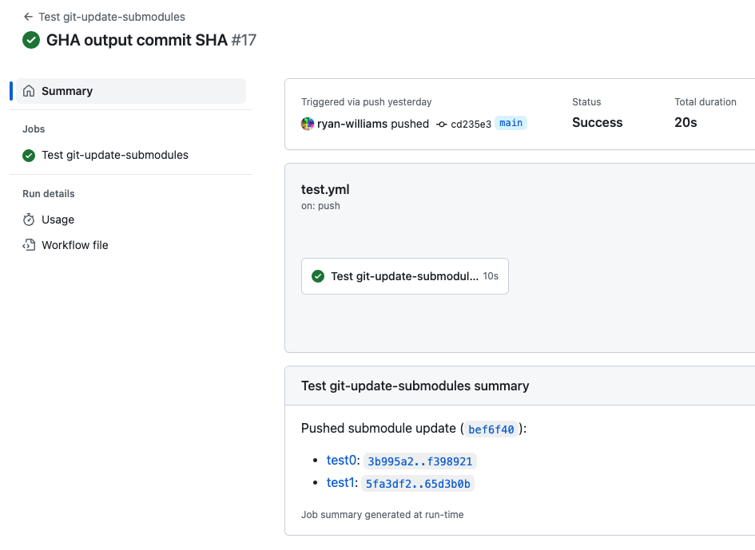

# update-submodules
 Update a repo's submodules without cloning it (using the GitHub API)
 - [Python library](#python-library)
 - [GitHub Action](#github-action)

## Python Library <a id="python-library"></a>
```bash
pip install update-submodules
```
### Update submodules directly via the GitHub API
```bash
github-update-submodules --help
# Usage: github-update-submodules [OPTIONS] [REF_STRS]...
#
#   Update submodules in a GitHub repository, using the API / without cloning
#   the repository.
#
#   Positional <ref_str> arguments can be of the form `<submodule>=<ref>` or
#   just `<ref>` (to set a fallback for all submodules).
#
# Options:
#   -b, --branch TEXT               Branch to update, defaults to `[
#                                   $GITHUB_EVENT_NAME == pull_request ] &&
#                                   $GITHUG_HEAD_REF || $GIRHUB_REF_NAME`
#   -F TEXT                         Files containing commit log message
#                                   paragraphs, use "-" to read from the
#                                   standard input. Can be passed more than
#                                   once.
#   -g, --github-step-summary TEXT  Write a summary of the new commit to this
#                                   path (defaults to $GITHUB_STEP_SUMMARY, "-"
#                                   for stdout, "" to disable)
#   -j, --num-jobs INTEGER          Max number of parallel jobs while fetching
#                                   current submodule SHAs (default: 0 ⟹
#                                   cpu_count())
#   -m, --message TEXT              Message paragraphs in the commit log
#                                   message, can be passed more than once.
#   -o, --github-output TEXT        Write the newly-created commit's SHA to this
#                                   path (defaults to $GITHUB_OUTPUT, "-" for
#                                   stdout, "" to disable)
#   -R, --repository TEXT           Repository name (with owner, e.g.
#                                   "owner/repo"), defaults to
#                                   $GITHUB_REPOSITORY then `gh repo view --json
#                                   nameWithOwner`
#   --help                          Show this message and exit.
```

### Update submodules in cloned repositories (including "bare" clones)
If your repository is already cloned (including "bare" clones), `git-update-submodules` works similarly (including `push`ing):
```bash
git-update-submodules --help
# Usage: git-update-submodules [OPTIONS] [REF_STRS]...
#
#   Update submodules in a locally-cloned Git repository.
#
#   Positional <ref_str> arguments can be of the form `<submodule>=<ref>` or
#   just `<ref>` (to set a fallback for all submodules).
#
# Options:
#   -F TEXT             Pass-through to `git commit-tree`'s `-F` flag: read the
#                       commit log message from the given file. Use - to read
#                       from the standard input. This can be given more than
#                       once and the content of each file becomes its own
#                       paragraph.
#   -m, --message TEXT  Pass-through to `git commit-tree`'s `-m/--message` flag:
#                       a paragraph in the commit log message. This can be given
#                       more than once and each <message> becomes its own
#                       paragraph.
#   -p, --parent TEXT   Pass-through to `git commit-tree`'s `-p/--parent` flag:
#                       each -p indicates the id of a parent commit object.
#   -R, --no-reset      Skip calling `git reset <new commit ID>`
#   -S, --gpg-sign      Similar to `git commit-tree`'s `-S/--gpg-sign` flag:
#                       GPG-sign commits with the committer identity.
#   --gpg-sign-as TEXT  Similar to `git commit-tree`'s `--gpg-sign=<keyid>`:
#                       GPG-sign commits with the specified <keyid>.
#   -v, --verbose       1x: print tree, commit SHAs; 2x: also print `git`
#                       commands as they are run; 3x: print `git ls-tree` output
#                       for new commit
#   --help              Show this message and exit.
```
This also works on repos hosted outside GitHub.

## GitHub Action <a id="github-action"></a>
Example usage:
```yaml
steps:
  # Update the current $GITHUB_REPOSITORY's default branch to contain the latest SHA on each submodule's default branch
  - uses: runsascoded/update-submodules@v1
    with:
      token: ${{ secrets.GITHUB_TOKEN }}
```

Specific refs can be provided per-submodule, and non-default branches can be updated:
```yaml
steps:
  - uses: runsascoded/update-submodules@v1
    with:
      # Specific branch/tag for 2 submodules, `develop` branch for others
      refs: submodule1=main submodule2:refs/tags/v1.0.0 develop
      # Update a non-HEAD branch
      branch: develop
      token: ${{ secrets.GITHUB_TOKEN }}
```

If the action creates a commit (containing newly-updated submodules), the commit's SHA is stored as an "output":
```yaml
steps:
  - uses: runsascoded/update-submodules@v1
    id: update
    with:
      token: ${{ secrets.GITHUB_TOKEN }}
  - run: echo "Pushed new commit ${{ steps.update.outputs.sha }} with updated submodules"
```

The Action also prints a summary on the workflow "summary" page, like:
[](https://github.com/runsascoded/.rc/actions/runs/5755454755)
([from runsascoded/.rc](https://github.com/runsascoded/.rc/blob/server/.github/workflows/update-branches.yml))

or:
[](https://github.com/runsascoded/update-submodules/actions/runs/5757404520)
([from `.github/workflows/test.yml`](./.github/workflows/test.yml))

## Similar Projects / Links
I looked at the following libraries and examples, but they mostly require cloning the repo, which I wanted to avoid:

- https://github.blog/2020-12-21-get-up-to-speed-with-partial-clone-and-shallow-clone/
- https://github.com/robherley/shallow-fetch-sha
- https://github.com/marketplace/actions/github-action-submodule-updates
- https://thenewstack.io/how-to-trigger-github-actions-on-submodule-updates/
- https://stackoverflow.com/questions/64407333/using-github-actions-to-automatically-update-the-repos-submodules
- https://docs.github.com/en/code-security/dependabot/dependabot-version-updates/configuration-options-for-the-dependabot.yml-file#package-ecosystem

### Github Actions
- https://github.com/marketplace/actions/submodule-branch-check
- https://github.com/marketplace/actions/github-action-submodule-updates
